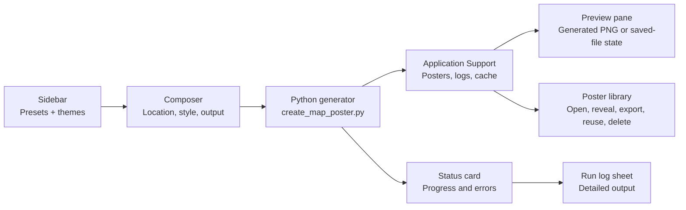

# macOS App Design Notes

The macOS app uses a native split-view workflow with a shared visual layer in
`Sources/MapToPosterMac/Support/AppDesign.swift`.

The app is available as an Xcode project at `MapToPosterMac.xcodeproj`. The
project is generated from `project.yml`, which keeps the Xcode target aligned
with the Swift source tree and configures the Run scheme with `MAPTOPOSTER_ROOT`
so app launches can find the Python generator and theme files.

## Principles

- Keep navigation Mac-native: one configuration column, one poster preview
  column, a small toolbar for secondary maintenance actions, and one visible
  primary action inside the setup flow.
- Use a light graphite grey gradient as the window atmosphere with light-blue
  accents for focus, progress, and creative energy.
- Let poster themes remain visible inside the workflow instead of replacing the
  app identity.
- Prefer standard SwiftUI controls and accessibility semantics, then add custom
  drawing only where it makes the preview feel alive.
- Respect Reduce Motion by turning the animated placeholder map into a static
  sketch.
- Keep the generation flow top-to-bottom: location lookup, poster settings,
  advanced labels, generate, then compact status. Detailed logs are available
  from the status card.
- Keep generated output visually separate on the right side so the poster is
  always the largest object on screen.
- Store app-generated posters, local logs, and Python cache data under
  Application Support rather than writing app runtime data back into the repo.
- Keep a local poster library with metadata so users can reopen, reveal, export,
  delete, or reuse prior generation settings without searching Finder.
- Treat location as a free-form search query so users can enter ZIP codes,
  city/state, addresses, landmarks, or city/country without choosing the
  structure first.
- Run a lightweight OpenStreetMap reachability preflight before new networked
  generations, and offer Cache only mode for privacy-conscious or offline reuse
  of already cached places.
- Keep cache clearing available from the library surface while preserving
  generated posters and logs.
- Persist redacted run logs by default. Exact coordinates and machine-control
  event payloads should not be exposed in the app UI.
- Use system materials for glass surfaces and avoid dark scrims or custom
  toolbar chrome that fights macOS Liquid Glass. Custom panels use shared
  material treatment only for app-specific surfaces.

## Accessibility Review Gate

Every macOS, iOS, iPadOS, or shared Apple-platform implementation pass includes
an accessibility review before handoff. For this app, review:

- VoiceOver names and hints for ZIP lookup, preset buttons, size buttons,
  format controls, cache-only mode, generation status, preview actions, and the
  poster library.
- Full Keyboard Access through the top-to-bottom generator flow, sheets,
  preview actions, and destructive library actions.
- Progress, error, empty, and success states without relying on color alone.
- Reduce Motion behavior for the animated map sketch and contrast/readability
  across the light graphite and blue glass backgrounds.
- Text scaling and truncation in the left composer column, status panel, poster
  library rows, and custom size fields.

## Screen Flow

## Token Structure

- `AppDesign.graphiteTop`, `graphiteBottom`: primary grey gradient.
- `AppDesign.mistBlue`, `clearBlue`, `inkBlue`: light-blue and deep-blue
  accents.
- `AppDesign.actionBlue`: primary action color for high-contrast generation
  controls.
- `AppDesign.cornerRadius`, `compactRadius`: shared geometry scale.
- `appPanel(prominent:)`: reusable material panel treatment for composer
  sections.
