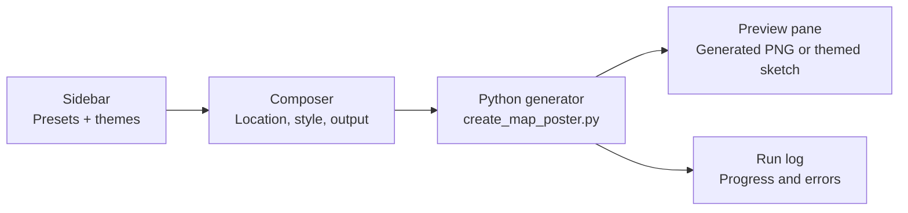

# macOS App Design Notes

The macOS app uses a native split-view workflow with a shared visual layer in
`Sources/MapToPosterMac/Support/AppDesign.swift`.

The app is available as an Xcode project at `MapToPosterMac.xcodeproj`. The
project is generated from `project.yml`, which keeps the Xcode target aligned
with the Swift source tree and configures the Run scheme with `MAPTOPOSTER_ROOT`
so app launches can find the Python generator and theme files.

## Principles

- Keep navigation Mac-native: one configuration column, one poster preview
  column, a small toolbar for secondary maintenance actions, and one visible
  primary action inside the setup flow.
- Use a light graphite grey gradient as the window atmosphere with light-blue
  accents for focus, progress, and creative energy.
- Let poster themes remain visible inside the workflow instead of replacing the
  app identity.
- Prefer standard SwiftUI controls and accessibility semantics, then add custom
  drawing only where it makes the preview feel alive.
- Respect Reduce Motion by turning the animated placeholder map into a static
  sketch.
- Keep the generation flow top-to-bottom: location lookup, poster settings,
  advanced labels, generate, then run log at the bottom of the left column.
- Keep generated output visually separate on the right side so the poster is
  always the largest object on screen.
- Treat location as a free-form search query so users can enter ZIP codes,
  city/state, addresses, landmarks, or city/country without choosing the
  structure first.
- Use system materials for glass surfaces and avoid dark scrims or custom
  toolbar chrome that fights macOS Liquid Glass. Custom panels use shared
  material treatment only for app-specific surfaces.

## Screen Flow

## Token Structure

- `AppDesign.graphiteTop`, `graphiteBottom`: primary grey gradient.
- `AppDesign.mistBlue`, `clearBlue`, `inkBlue`: light-blue and deep-blue
  accents.
- `AppDesign.cornerRadius`, `compactRadius`: shared geometry scale.
- `appPanel(prominent:)`: reusable material panel treatment for composer
  sections.
